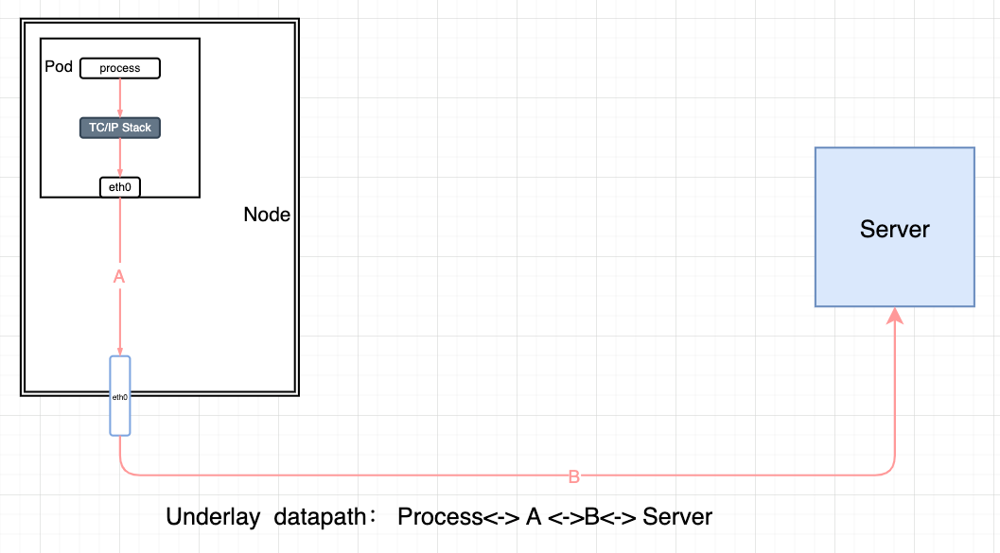
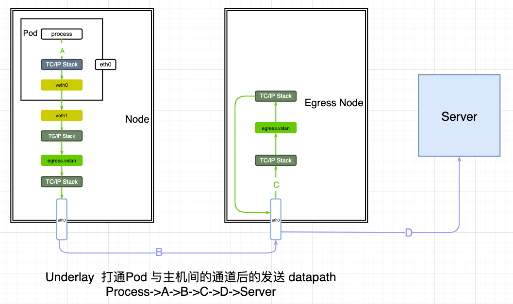
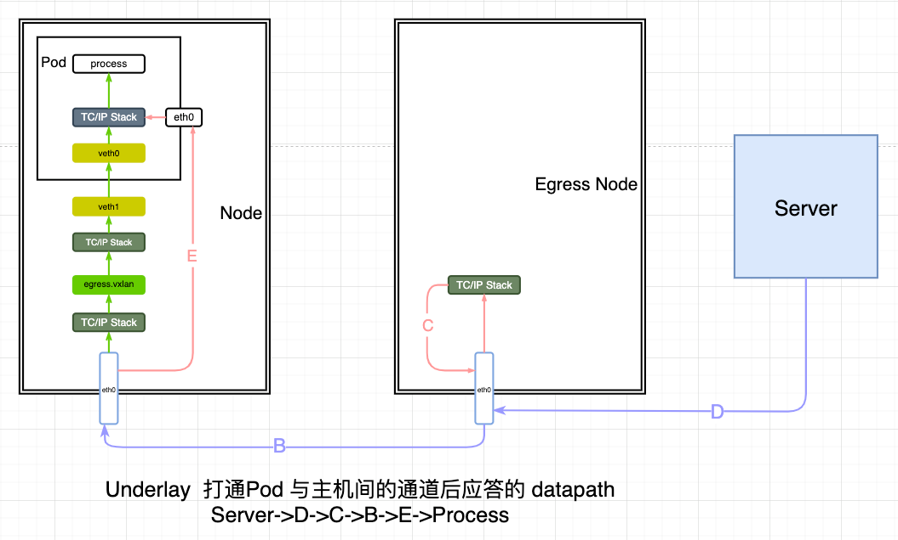
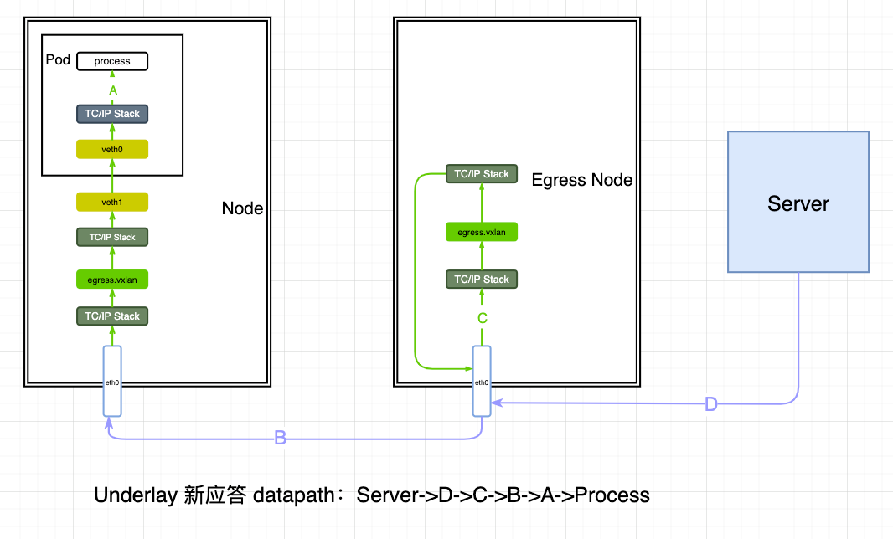

# Underlay CNI supports

## Motivation

EgressGateway is not available in an Underlay CNI environment.

## Target

EgressGateway supports nanotube traffic in an Underlay CNI environment.

## Problems to be solved

As shown in the diagram, the datapath for the round-trip Underlay access to the external Server is: "Process <-> A <-> B <-> Server".



The EgressGateway's rules don't work at all, and in order to pipe the Underlay traffic, two things need to be addressed, hijacking the traffic to the Pod's host and avoiding routing asymmetric messages from being dropped when the answering traffic arrives at the Pod's host

## Hijack a Pod message that matches the EgressGateway policy to the host on which it resides

There are two things you need to do to solve this problem:
1, open the channel between the Pod and the host.
2, so that messages matching the policy are forwarded to the host through the channel.

First, overlay + underlay can be realized with the help of the overlay NIC. For a single underlay, when the Pod is created, use a veth pair with one end on the host and the other end plugged into the Pod's network namespace. To accomplish the above, a kubelet call to CNI during pod creation can do it, a spiderpool plugin can just do it, or a privileged agent Pod can do it (the path is a bit wild).

Thing 2, you can route, iptables, etc. to forward the matched traffic to the host via the veth pair in front of you. This can be done by setting spiderpool crd spidercoordinators.spec.hijackCIDR, and spiderpool will set the appropriate route. The rules can also be set via sidecar.

### Send datapath

As shown in the figure, by adding a new veth pair and routing the traffic through the veth to the host, the datapath is actually the same as the overlay.



### Reply datapath

As shown in the figure, the datapath returned is "Server->D->C->B->E->Process"



- The srcIP=ServerIP, dstIP=EIP of the message as it passes through the D-segment datapath to the EgressGateway.
- The C datapath looks up the connection tracking table and NATs the message, srcIP=ServerIP, dstIP=PodIP.
- B segment datapath, because it is an underlay environment, so the EgressNode can communicate directly with the Pod, through the switch or router, the message goes directly to the Pod, you can see that at this time does not go through the host's network namespace. You can see that the message does not go through the host's network namespace at this time. This will lead to routing asymmetry problems

## Returned message routing asymmetry problem

Here's a quick rundown of why the problem occurs:

- The first message of the three-way handshake, SYN, arrives at the host from the Pod, passes through the host's network stack, and is packetized and forwarded out.
- The second message of the three handshakes, SYN+ACK, arrives at the EgressNode node, then goes directly to the physical NIC of the node where the Pod is located, and then arrives directly at the Pod, without going through the host's network stack, resulting in inconsistent routing.
- The third message of the three handshakes, ACK, arrives at the host from the Pod, because it does not receive the SYN+ACK message, but directly receives the ACK message, which is considered to be an invalid packet, and thus is discarded by one of the kube-proxy's DROP rules, resulting in the failure of the three handshakes.

``` shell
Chain KUBE-FORWARD (1 references)
 pkts bytes target prot opt in out source destination
    0 0 DROP all -- * * * 0.0.0.0/0 0.0.0.0/0 ctstate INVALID
```

To solve this problem, you need to ensure that the return packet also passes through the network namespace of the host where the Pod is located in order to avoid the above problem. Instead of returning the packet directly to the Pod, the packet can be tunneled back through the EgressGateway to the node where the Service Pod resides by setting up the appropriate rules on the egress gateway node. this can be accomplished as follows:

``` shell
On the egress gateway node, new connections coming through the tunnel are marked as EgressGateway hits.
iptables -t mangle -A PREROUTING -i egress.vxlan -m conntrack --ctstate NEW -j MARK --set-mark 0x27

Add mark to the connection tracking table for recovery on packet return
iptables -t mangle -A PREROUTING -m mark --mark 0x27 -j CONNMARK --save-mark


ESTABLISHED connections, packets need to be recovered based on the contents of the connection tracking table Mark
iptables -t mangle -A PREROUTING -m conntrack --ctstate ESTABLISHED -j CONNMARK --restore-mark


Add routes to tunnel the packets back, one for each of them
ip rule add from all fwmark 0x27 lookup 600
ip r add <Pod IP> via <Pod Node> dev egress.vxlan t 600

Clear the mark of the inner packets to avoid interfering with the outer packets
iptables -t mangle -A POSTROUTING -m mark --mark 0x27 -j MARK --set-mark 0x00
```

As shown in the figure, after the above rule, the new answer datapath is "Server->D->C->B->A->Process"



The biggest difference is that from the gateway node to the node where the Pod is located, it is through the EgressGateway tunnel, and after the message arrives at the node where the Pod is located, it is forwarded to the Pod from the veth pair through the route, and the spiderpool will send out the corresponding route when it creates the veth pair for the Pod, or it can send out the corresponding route through the agent. The spiderpool will issue the corresponding route while creating the veth pair for the Pod, or it can issue the corresponding routing rules through the agent. Because it passes through the host's network stack. This avoids the routing asymmetry problem.

## Summary

Except for the rules that need to be issued at the gateway node so that the answer message can be returned to the Pod through the EgressGateway, everything else that needs to be done can be accomplished with the help of the spiderpool configuration.
